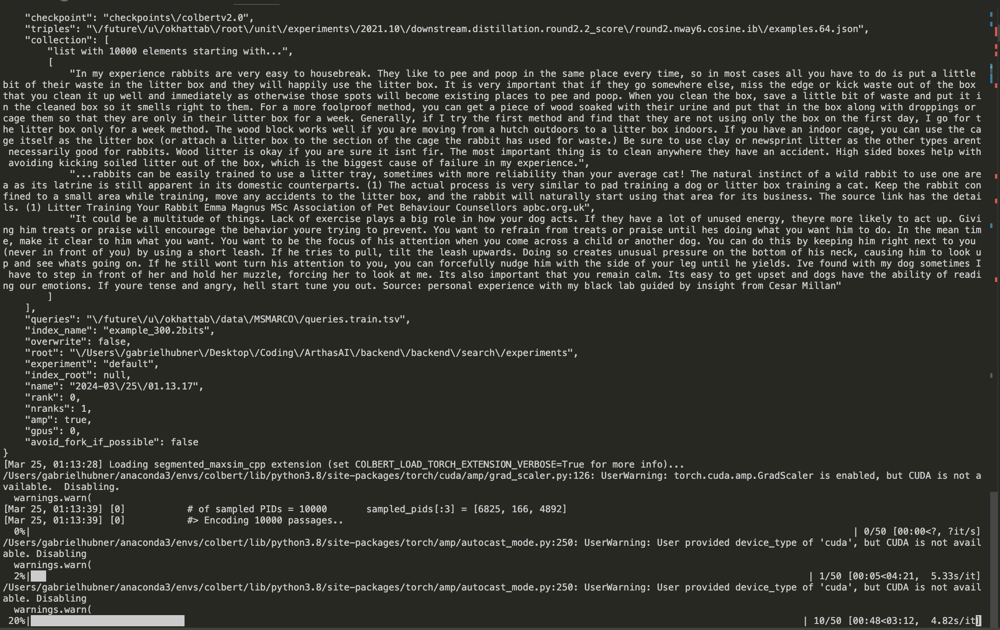
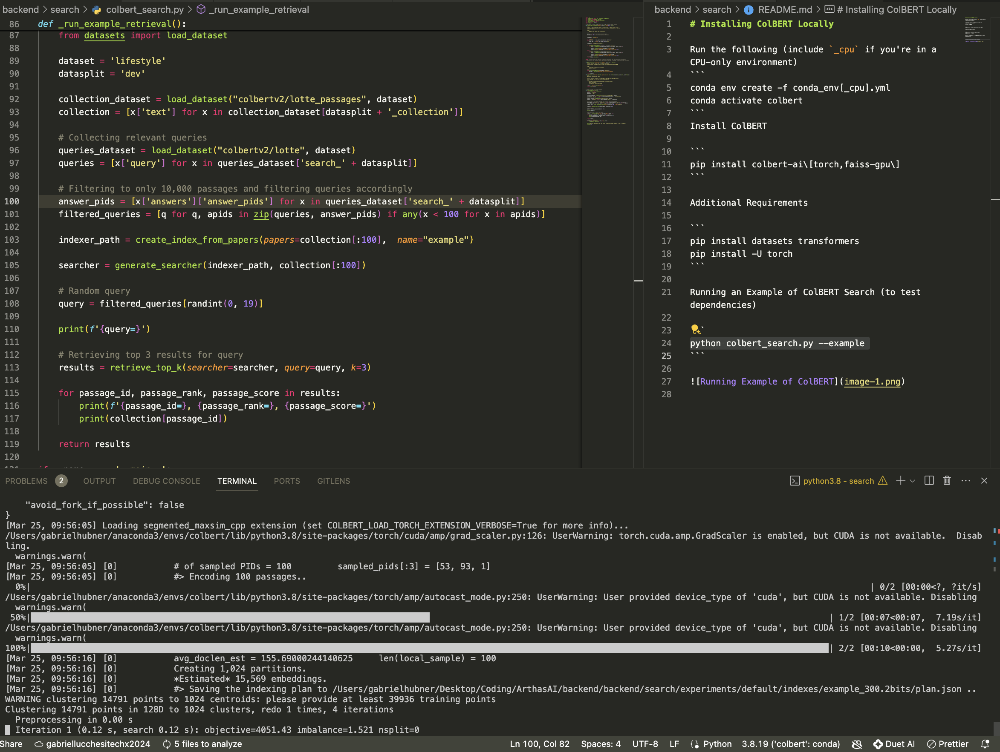

# Installing ColBERT Locally

Run the following (include `_cpu` if you're in a CPU-only environment)
```
conda env create -f conda_env[_cpu].yml
conda activate colbert
```
Install ColBERT

```
pip install colbert-ai\[torch,faiss-gpu\]
```

Additional Requirements

```
pip install datasets transformers
pip install -U torch
```

Running an Example of ColBERT Search (to test dependencies)

```
python colbert_search.py --example
```





# How this works:
ColBERT uses an Indexer object that compresses documents into an indexable "binary" format. The objects are stored in the folder `./experiments` and each experiment has its own subfolder. Inside each experiment's subfolder (defaulted to `./experiments/default`), there is a list of indices represented as folders. These indices are tied directly to Searcher objects generated so they can perform search on them. 

To create the searcher using its relative name (i.e., not a full path), set `experiment=value_used_for_indexing` in the `RunConfig`.
